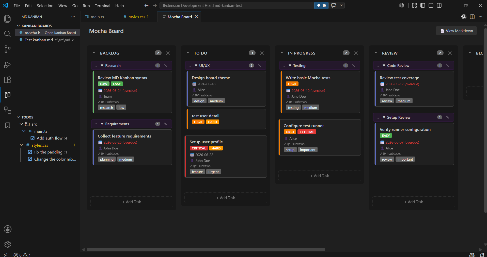
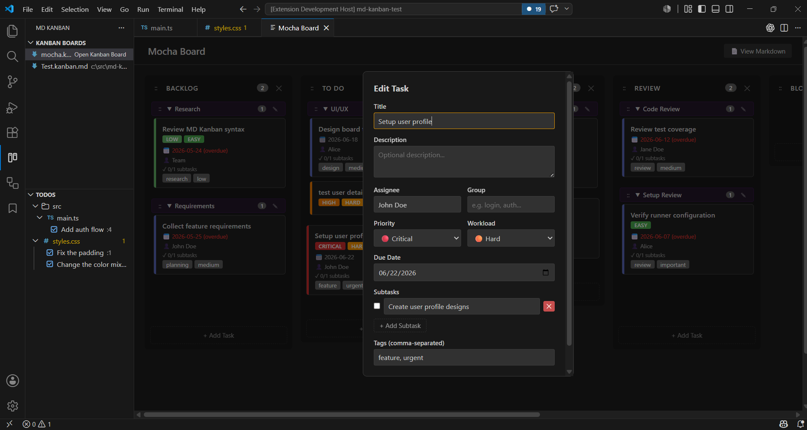
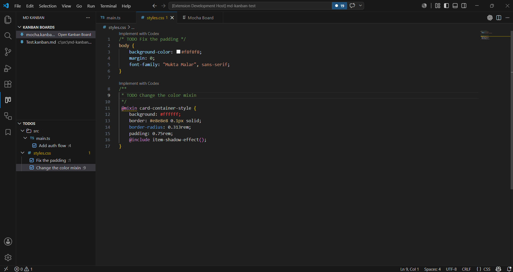

# MD Kanban

MD Kanban is a VS Code extension for managing tasks in a visual Kanban board while keeping the source of truth in plain Markdown.

Use it when you want a lightweight project board that lives with your code, works well with Git, and does not require an external service.


## Showcase

### Board View



### Add Task



###

### TODO View




## Why MD Kanban?

- **Local-first** - Your board is stored in `.kanban.md` files in your workspace.
- **Git-friendly** - Tasks are readable Markdown, so changes can be reviewed, diffed, and versioned.
- **No external account required** - Use a Kanban board without signing in to another service.
- **Visual when you want it, text when you need it** - Edit in the board UI or open the Markdown directly.
- **Built for VS Code workflows** - Manage project work without leaving the editor.
- **Project-aware** - Open boards and source TODOs from the MD Kanban Activity Bar view.

## Features

- Visual Kanban board for `.kanban.md` files.
- MD Kanban Activity Bar view with board and TODO sections.
- Multiple boards per workspace; every `*.kanban.md` file appears in the side panel.
- Drag cards between columns, within columns, into groups, out of groups, and to the end of a column.
- Card-sized drop indicators that show exactly where a card will land.
- Collapsible task groups backed by Markdown `###` headings.
- Rename groups with a modal; all cards in that group are updated together.
- Move whole groups with drag-and-drop.
- Add, rename, reorder, and delete columns.
- Task fields for description, tags, priority, workload, due date, assignee, and subtasks.
- Explorer-style TODO tree for `// TODO` and block-comment TODOs found in workspace source files.
- Priority strips, workload badges, overdue highlighting, and subtask progress.
- VS Code theme integration.
- File watching for changes made outside the visual board.
- Side-by-side raw Markdown view.

## Installation

### From the VS Code Marketplace

Install **MD Kanban** from the Visual Studio Marketplace once published, then run the commands below from the Command Palette.

### From a VSIX

If you have a packaged `.vsix` file:

1. Open VS Code.
2. Run **Extensions: Install from VSIX...**.
3. Select the `.vsix` file.

## Quick Start

1. Open the **MD Kanban** icon in the Activity Bar.
2. Click **Create New Kanban Board** in the **Kanban Boards** section.
3. Enter a board name. A `.kanban.md` file is created in your workspace.
4. Click any board in the side panel to open it.
5. Add tasks and drag cards around the board.

| Command | Description |
| --- | --- |
| `Kanban: Create New Kanban Board` | Create a new `.kanban.md` file with default columns |
| `Kanban: Open Kanban Board` | Open an existing `.kanban.md` file as a Kanban board |

You can keep more than one board in a workspace. Files such as `frontend.kanban.md`, `backend.kanban.md`, and `release.kanban.md` are listed as separate boards.

## Using the Board

### Tasks

- Click **+ Add Task** in a column to create a card.
- Add title, description, tags, priority, workload, due date, assignee, group, and subtasks.
- Hover over a card to edit or delete it.
- Drag cards to reorder them or move them between columns and groups.
- Use the blue dashed drop indicator to see where the card will land.

### Groups

- Tasks under a `###` heading belong to that group.
- Click a group header to collapse or expand it.
- Click the group edit icon to rename a group.
- Use the group drag handle (`::`) to move a whole group.
- Drop cards into a group to assign them.
- Drop cards into the ungrouped area or column end to remove them from a group.

### Columns

- Click **+ Add Column** to create a column.
- Click a column title to rename it.
- Use the column drag handle (`::`) to reorder columns.
- Use the delete icon to remove a column and its tasks.

### Markdown View

- Click **View Markdown** to open the raw board file beside the visual board.
- Manual Markdown edits are picked up by the board when the file changes.

### TODOs

- In the MD Kanban side panel, the **TODOs** section scans the workspace for source TODO comments.
- TODOs are grouped by folder and file. Folders and files expand and collapse like the Explorer.
- File rows use the active VS Code file icon theme. TODO rows use a checked icon and show the line number at the row end.
- Click a TODO item to open the source file at the matching line.
- TODOs are separate from `.kanban.md` boards. Edit or remove the original source comment to update them.

Supported TODO comment styles:

```ts
// TODO Add validation
/* TODO Add validation */
/**
 * TODO Add validation
 */
```

## Markdown Format

Board data is stored in plain Markdown. You can edit it manually or through the visual board.

```markdown
# My Project Board

## To Do

#### Set up database migrations
Create migration scripts for PostgreSQL schema changes.
- [x] Design schema
- [ ] Write migration files
- [ ] Add rollback scripts
Tags: `backend` `database`
<!-- priority: high -->
<!-- workload: hard -->
<!-- due: 2026-04-01 -->
<!-- assignee: Alice -->

### Sprint 1

#### Implement user auth
Add OAuth2 support for Google and GitHub.
Tags: `feature` `auth`
<!-- priority: critical -->
<!-- assignee: Bob -->

#### Ungrouped task after a group
<!-- group: -->
This task is explicitly ungrouped even though it appears after a group heading.
```

### Headings

| Heading | Meaning |
| --- | --- |
| `#` | Board title |
| `##` | Column |
| `###` | Task group |
| `####` | Task |

### Task Metadata

Metadata is stored as HTML comments under a task.

| Comment | Values |
| --- | --- |
| `<!-- priority: VALUE -->` | `critical`, `high`, `medium`, `low` |
| `<!-- workload: VALUE -->` | `easy`, `normal`, `hard`, `extreme` |
| `<!-- due: YYYY-MM-DD -->` | Any valid date |
| `<!-- assignee: NAME -->` | Free text |
| `<!-- group: NAME -->` | Explicit group assignment |
| `<!-- group: -->` | Explicitly mark a task as ungrouped |

Other supported task content:

- **Description**: Plain text below the task heading.
- **Subtasks**: `- [x] Done item` / `- [ ] Pending item`.
- **Tags**: `Tags: \`tag-name\` \`another-tag\``.

## Privacy

MD Kanban stores board data in local Markdown files in your workspace. It does not require an account or send your task data to an external service.

## Contributing

Contributions are welcome. If you find a bug or have an idea, please open an issue or pull request in the repository.

### Development Setup

```bash
git clone https://github.com/jebakumarj/md-kanban.git
cd md-kanban
npm install
npm run compile
```

Press **F5** in VS Code to launch an Extension Development Host.

## Requirements

- VS Code 1.109 or newer.
- Node.js 16 or newer for local development.

## License

MIT

Co-authored with Codex